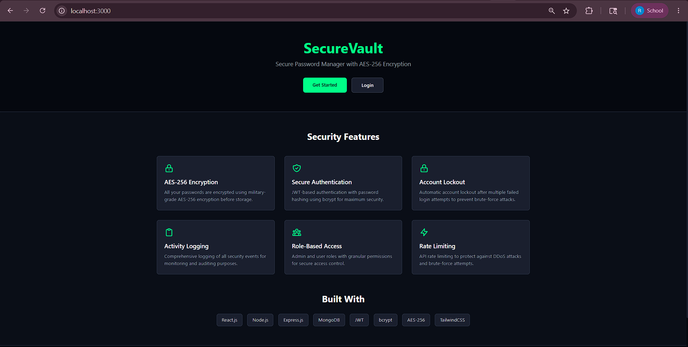
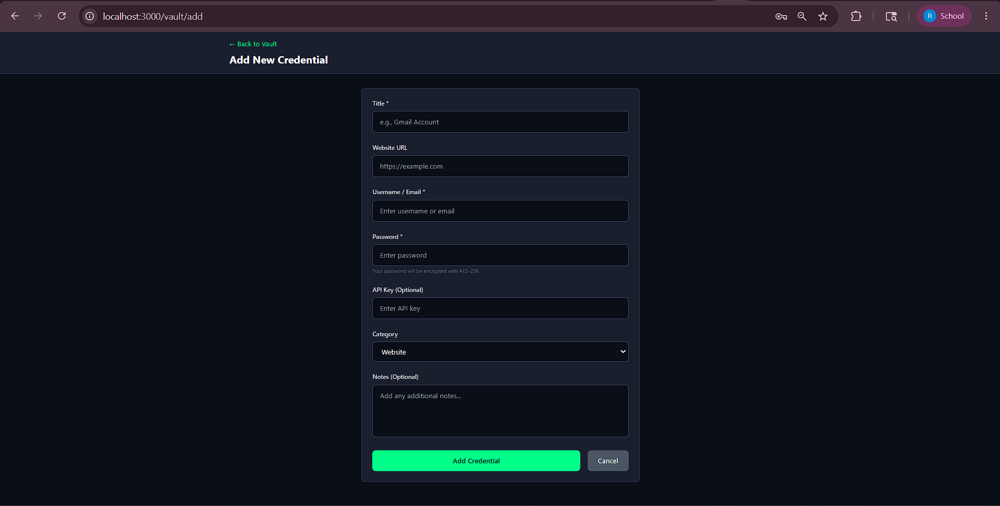
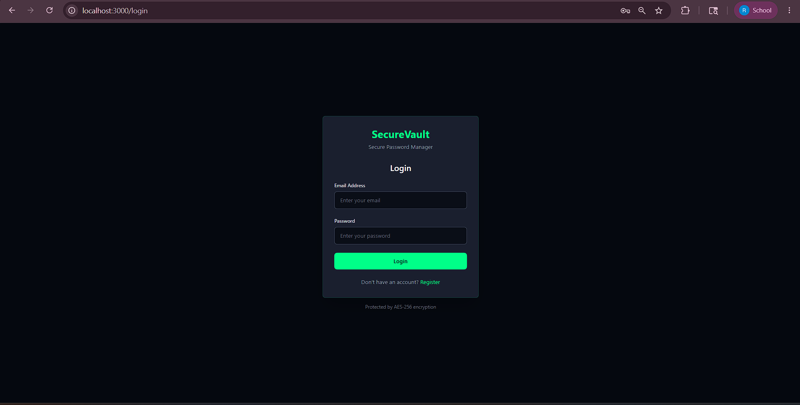
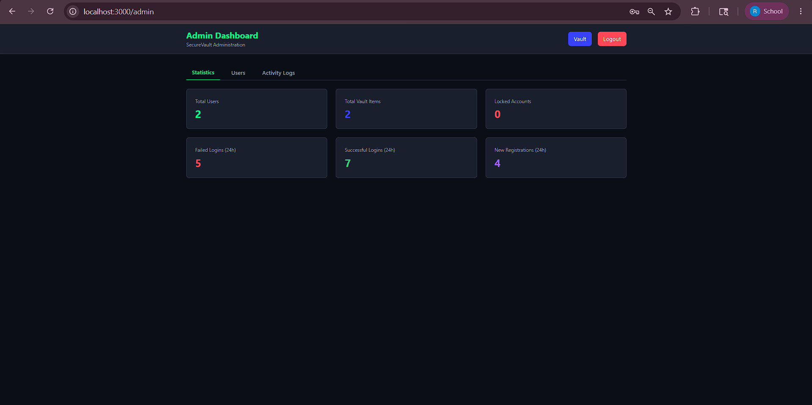

# SecureVault - Secure Password Manager

A full-stack MERN cybersecurity project demonstrating practical security concepts including authentication, authorization, RBAC, encryption, password hashing, API protection, and secure credential storage.






## 🚀 Features

### Security Features
- **Authentication**: JWT-based authentication with secure token handling
- **Password Security**: bcrypt hashing with automatic salting
- **Encryption**: AES-256 encryption for stored credentials
- **RBAC**: Role-Based Access Control (Admin/User roles)
- **Rate Limiting**: Protection against brute-force attacks
- **Input Validation**: Comprehensive validation on all inputs
- **Security Headers**: Helmet for HTTP security headers
- **Activity Logging**: Track all security-related events
- **Account Lockout**: Automatic lock after failed login attempts

### Core Features
- User registration and login
- Secure password vault
- Add, edit, delete credentials
- Store website passwords, API keys, secure notes
- Search credentials
- Show/hide passwords securely
- Admin dashboard with user management
- Activity log monitoring

## 🛠️ Tech Stack

### Frontend
- React.js
- TailwindCSS
- Axios
- React Router DOM
- Context API

### Backend
- Node.js
- Express.js
- MongoDB
- Mongoose
- JWT
- bcryptjs
- crypto module
- express-rate-limit
- helmet
- cors
- dotenv

## 📋 Prerequisites

- Node.js (v14 or higher)
- MongoDB (v4.4 or higher)
- npm or yarn

## 🔧 Installation

### 1. Clone the repository
```bash
git clone <repository-url>
cd SecureVault
```

### 2. Install dependencies
```bash
npm run install:all
```

Or install separately:
```bash
# Backend dependencies
cd backend
npm install

# Frontend dependencies
cd frontend
npm install
```

### 3. Environment Configuration

Create a `.env` file in the `backend` directory:

```env
# Server Configuration
PORT=5000
NODE_ENV=development

# MongoDB Configuration
MONGODB_URI=mongodb://localhost:27017/securevault

# JWT Configuration
JWT_SECRET=your_super_secret_jwt_key_change_this_in_production
JWT_EXPIRE=7d

# Encryption Key (32 characters for AES-256)
ENCRYPTION_KEY=your_32_character_encryption_key_here

# Rate Limiting
RATE_LIMIT_WINDOW_MS=900000
RATE_LIMIT_MAX_REQUESTS=100

# Account Lockout
MAX_LOGIN_ATTEMPTS=5
LOCK_TIME_MS=900000
```

### 4. Start MongoDB
Make sure MongoDB is running on your system:
```bash
# On Windows
net start MongoDB

# On Mac/Linux
sudo systemctl start mongod
# or
mongod
```

### 5. Run the application

#### Development Mode (Both frontend and backend)
```bash
npm run dev
```

#### Run separately
```bash
# Backend (Terminal 1)
cd backend
npm run dev

# Frontend (Terminal 2)
cd frontend
npm start
```

### 6. Access the application
- Frontend: http://localhost:3000
- Backend API: http://localhost:5000

## 📁 Project Structure

```
SecureVault/
├── backend/
│   ├── config/
│   │   └── database.js
│   ├── controllers/
│   │   ├── authController.js
│   │   ├── vaultController.js
│   │   └── adminController.js
│   ├── middleware/
│   │   ├── authMiddleware.js
│   │   ├── rbacMiddleware.js
│   │   ├── rateLimiter.js
│   │   ├── validationMiddleware.js
│   │   ├── errorHandler.js
│   │   └── activityLogger.js
│   ├── models/
│   │   ├── User.js
│   │   ├── VaultItem.js
│   │   └── SecurityLog.js
│   ├── routes/
│   │   ├── authRoutes.js
│   │   ├── vaultRoutes.js
│   │   └── adminRoutes.js
│   ├── utils/
│   │   └── encryption.js
│   ├── .env.example
│   ├── server.js
│   └── package.json
├── frontend/
│   ├── public/
│   ├── src/
│   │   ├── components/
│   │   ├── context/
│   │   ├── layouts/
│   │   ├── pages/
│   │   ├── services/
│   │   ├── App.js
│   │   └── index.js
│   ├── package.json
│   └── tailwind.config.js
├── .gitignore
├── package.json
└── README.md
```

## 🔐 Security Concepts Demonstrated

### 1. Password Hashing vs Encryption
- **Hashing**: One-way transformation using bcrypt. Passwords are hashed before storage and cannot be reversed.
- **Encryption**: Two-way transformation using AES-256. Credentials are encrypted before storage and can be decrypted with the key.

### 2. JWT Authentication Flow
1. User logs in with credentials
2. Server verifies credentials and generates a JWT token
3. Token is sent to client and stored securely
4. Client includes token in subsequent requests
5. Server verifies token before granting access

### 3. RBAC Implementation
- Roles: Admin, User
- Middleware checks user role before allowing access
- Protected routes based on permissions
- Admin has elevated privileges for user management

### 4. Security Middleware
- **Helmet**: Sets security-related HTTP headers
- **Rate Limiting**: Prevents brute-force attacks
- **Input Validation**: Sanitizes user input
- **CORS**: Controls cross-origin requests
- **Activity Logging**: Tracks security events

## 👥 Default Users

After first registration, you can manually create an admin user in MongoDB:

```javascript
{
  "username": "admin",
  "email": "admin@securevault.com",
  "password": "hashed_password_here",
  "role": "admin"
}
```

Or register through the UI and update the role in the database.

## 🧪 Testing the Application

1. Register a new user
2. Login with the registered user
3. Add credentials to your vault
4. Test encryption (check database - passwords should be encrypted)
5. Test edit and delete functionality
6. Create an admin user
7. Access admin dashboard
8. View activity logs

## 📝 API Endpoints

### Authentication
- `POST /api/auth/register` - Register new user
- `POST /api/auth/login` - Login user
- `POST /api/auth/logout` - Logout user
- `GET /api/auth/me` - Get current user

### Vault
- `GET /api/vault` - Get all vault items
- `POST /api/vault` - Add new credential
- `PUT /api/vault/:id` - Update credential
- `DELETE /api/vault/:id` - Delete credential

### Admin
- `GET /api/admin/users` - Get all users
- `GET /api/admin/stats` - Get dashboard statistics
- `GET /api/admin/logs` - Get activity logs

## 🔒 Security Best Practices Implemented

1. **Never store passwords in plain text** - Always use bcrypt
2. **Use HTTPS in production** - Encrypt data in transit
3. **Validate all inputs** - Prevent injection attacks
4. **Use environment variables** - Never hardcode secrets
5. **Implement rate limiting** - Prevent brute-force attacks
6. **Log security events** - Monitor for suspicious activity
7. **Use strong encryption** - AES-256 for sensitive data
8. **Implement RBAC** - Least privilege principle
9. **Set security headers** - Helmet middleware
10. **Handle errors securely** - Don't leak sensitive information

## 🐛 Troubleshooting

### MongoDB Connection Error
- Ensure MongoDB is running
- Check MONGODB_URI in .env file
- Verify MongoDB is accessible on the specified port

### JWT Token Issues
- Check JWT_SECRET in .env file
- Ensure token is being sent in Authorization header
- Verify token hasn't expired

### Encryption Errors
- Ensure ENCRYPTION_KEY is exactly 32 characters
- Check that crypto module is available

### CORS Issues
- Check frontend URL in CORS configuration
- Verify API base URL in frontend services

## 📄 License

MIT License

## 👨‍💻 Author

Built as a cybersecurity demonstration project

## 🙏 Acknowledgments

- bcryptjs for password hashing
- Node.js crypto module for encryption
- Express.js for backend framework
- React.js for frontend framework
